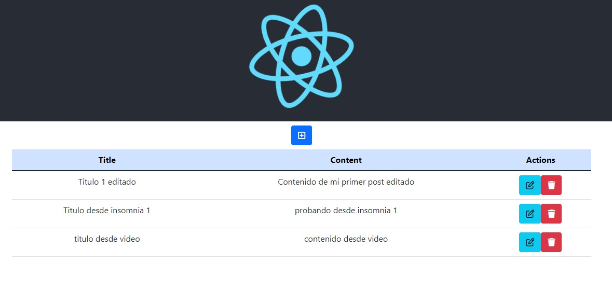

## CRUD fullStack

Un CRUD fullStack, realizado con React, node y Mysql, es original del canal [informaticaDP](https://www.youtube.com/c/Inform%C3%A1ticaDP);
con algunas modificaciones personales.
Dentro de la carpeta node se encuentra una carpeta llamada "bk", que contiene la base de datos en mysql, para que la importes si descargas el proyecto (debes tener algun paquete de servidor web como XAMPP ó WAMP).

# backend:

- "cors": "^2.8.5",
- "express": "^4.18.1",
- "mysql2": "^2.3.3",
- "sequelize": "^6.23.1"

# front:

- "axios": "^0.27.2",
- "react": "^18.2.0",
- "react-dom": "^18.2.0",
- "react-router-dom": "^6.4.1",
